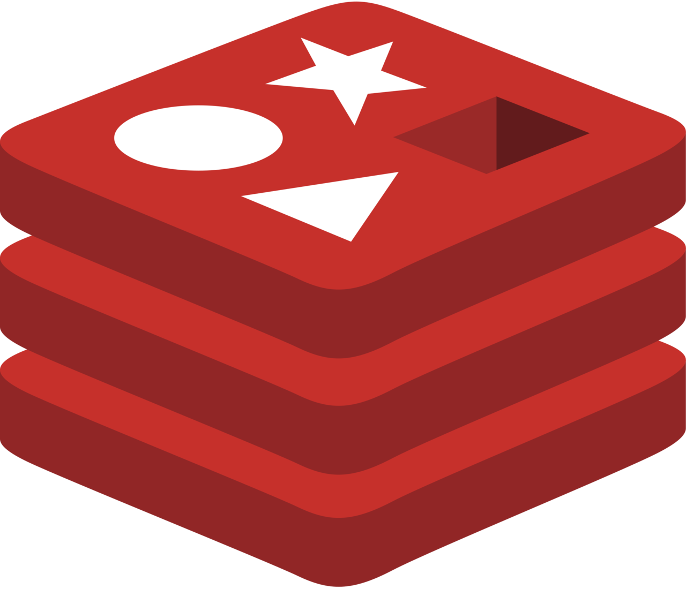

# 🦸♀ Skills

### Languages

|                                    |                                                                                                               |         |
| :--------------------------------: | ------------------------------------------------------------------------------------------------------------- | ------- |
|                                    |                                                                                                               |         |
|  | 
<strong>Python</strong>

Micro-service Design, Async &#x26; Await, Flask, Quart, Pub/Sub, 
 | 5 Years |
|                                    |                                                                                                               |         |
|                                    |                                                                                                               |         |

### Databases

|  | 
<strong>MongoDB</strong>

JSON Design, Operation, Backup, Kubernetes Deployment, Atlas
              | 3 Years |
| :-----------------------------------------------------------------------------------------------------------------------------------------------------------------------: | ---------------------------------------------------------------------------------------------------------------------- | ------- |
|                                                                                                                                         | 
<strong>PostgreSQL</strong>

Schema Design, Operation, Backup, Kubernetes Deployment, Digital Ocean
 | 5 Years |
|                                                                Redis                                                                | KV Design, Operation, Backup, Kubernetes Deployment                                                                    | 5 Years |
|                                                                                                                                                                           |                                                                                                                        |         |
|                                                                                                                                                                           |                                                                                                                        |         |
